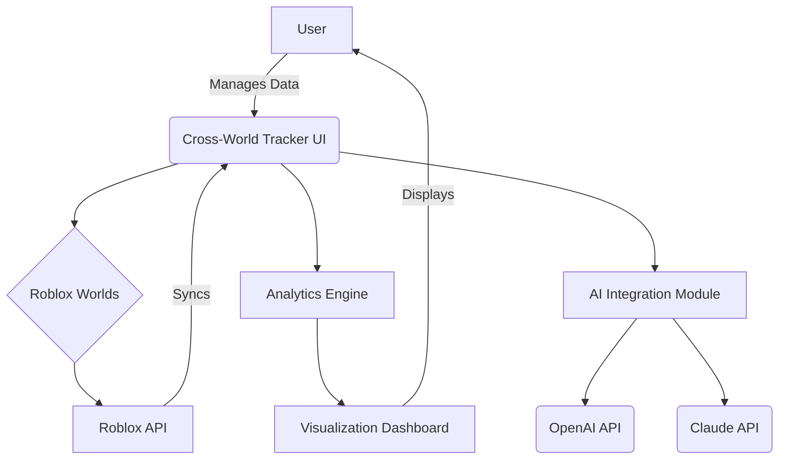

# 🚦 Multi-World-Tracker-Roblox  
*The Ultimate Cross-World Inventory, Character & Experience Tracker for Roblox Adventurers*  

**Description**:  
Multi-World-Tracker-Roblox is your all-in-one, seamless solution for synchronizing, tracking, and exploring your inventories, avatars, and virtual experiences across all your favorite Roblox worlds. Dive into powerful tools designed from the ground up for explorers who want to synchronize their progress, manage cross-game assets, and analyze their metaverse journey like never before—enhanced with next-gen AI suggestions, multilingual support, and round-the-clock customer guidance.

---

---

## 🌟 Table of Contents

- [Overview](#-overview)
- [Core Features](#-core-features)
- [Mermaid Architecture Diagram](#-mermaid-architecture-diagram)
- [🌍 Cross-Platform OS Compatibility](#-cross-platform-os-compatibility)
- [🔑 Key Features](#-key-features)
- [🤖 Advanced AI Integrations](#-advanced-ai-integrations)
- [🌎 Multilingual & Responsive UI](#-multilingual--responsive-ui)
- [🧑‍💻 Example Profile Configuration](#-example-profile-configuration)
- [🔗 Example Console Invocation](#-example-console-invocation)
- [⚠️ Disclaimer](#-disclaimer)
- [🔒 License](#-license)
- [⬇️ Download](#-download)

---

## 🌐 Overview

**Multi-World-Tracker-Roblox** is crafted for the new era of Roblox players: those who roam, build, share, and socialize across many user-created universes. Instead of focusing on a single inventory, avatar, or stats-set, this toolkit empowers you to visualize, synchronize, and enhance your entire cross-world journey.

Whether you’re hunting rare accessories, racing to leaderboard heights, or analyzing playtime and growth across genres, Multi-World-Tracker-Roblox is your reliable copilot—backed by the intelligence of OpenAI and Anthropic Claude APIs.

Focus your energy on exploring and building—never worry about losing track of achievements, valuable items, or friends met along the way.

---

## 🚀 Core Features

- **Cross-World Inventory Synchronization**  
  Track, manage, and compare your inventory items across multiple Roblox experiences in real time.

- **Avatar & Character Profile Manager**  
  Visualize all your avatars, outfits, and stat progressions, side-by-side, throughout the metaverse.

- **Multi-Experience Logger**  
  Automatically detect and log all visited Roblox games—see your journey and discover hidden patterns.

- **Interactive Analytics Dashboard**  
  Explore advanced analytics, graphical charts, and progress heatmaps—perfect for self-improvement & sharing.

- **AI-Powered Suggestions**  
  Receive recommendations on popular worlds, high-value items, and strategies to optimize your experience.

- **Advanced Search & Filtering**  
  Master your collection: Find, sort, and filter by rarity, usage, achievement, or in-game world.

- **Export & Share Profiles**  
  Generate public or private shareable profiles with integrated privacy controls.

- **Integrate with Messaging & Socials**  
  Seamlessly connect achievements to Roblox messages, Discord, or your social platforms.

- **OpenAI/Claude Chat Quick-Assist**  
  Instantly resolve inventory questions, get suggestions, or explain game concepts using deep AI integrations.

---

## 🛠️ Mermaid Architecture Diagram

---

## 🧩 Cross-Platform OS Compatibility

|  OS      | Supported | Notes            |
|----------|-----------|------------------|
| 🪟 Windows   |   ✅     | All modern versions |
| 🍎 macOS     |   ✅     | 10.13+            |
| 🐧 Linux     |   ✅     | Ubuntu, Fedora, Debian, Arch |
| 📱 iOS       |   🔜     | Planned for 2026  |
| 🤖 Android   |   🔜     | Planned for 2026  |
| 🌐 Web App   |   ✅     | Chrome, Firefox, Edge, Safari |

---

## 💡 Key Features

- **Responsive UI** – Enjoy seamless experience on all screen sizes, from desktop to tablet.
- **Roblox Integration** – Certified APIs for inventory, stats, and badges.
- **Export Formats** – PDF, CSV, PNG, or direct cloud export.
- **Data Privacy** – Secure, encrypted, and user-controlled data management.
- **Multilingual Support** – 10+ languages at launch, with community-driven translation workflow.
- **24/7 Customer Support** – Real humans or chatbot, your choice, whenever you need assistance.
- **Data Visualization** – 3D avatar previews, dynamic charts, growth analytics.
- **Cloud & Offline Support** – Reliable across devices and connectivity situations.

---

## 🧠 Advanced AI Integrations

- **OpenAI API (GPT x)**  
  Contextually aware assistant can suggest strategies, explain metaverse trends, or solve complex item queries.

- **Anthropic Claude API**  
  Dialogue and recommendation engine specializing in safe, nuanced advice for digital wellbeing within Roblox.

- **AI-Detected Achievements**  
  Get notified when you achieve personal bests, rare event unlocks, or trending items.

---

## 🌏 Multilingual & Responsive UI

Multi-World-Tracker-Roblox strives to speak your language, literally! At launch, it supports:

- English 🇺🇸
- Español 🇪🇸
- Français 🇫🇷
- Deutsch 🇩🇪
- Português 🇧🇷
- 中文 🇨🇳
- 日本語 🇯🇵
- Русский 🇷🇺
- 한국어 🇰🇷
- العربية 🇸🇦

…and is easily extensible using our translation pipeline. The modern UI adapts from wide monitors to mobile screens, and automatically applies your preferred regional settings.

---

## 🧑‍💻 Example Profile Configuration

**profiles/myEpicAdventure.json**

{
  "username": "PlayerExplorer",
  "worldsTracked": [
    "Adopt Me!",
    "Tower of Hell",
    "Brookhaven 🏡",
    "Murder Mystery 2"
  ],
  "trackedItems": [
    "Legendary Pet: Unicorn",
    "Golden Sword",
    "VIP Badge"
  ],
  "profilePrivacy": "friendsOnly",
  "preferredLanguage": "en-US",
  "notifications": {
    "onNewAchievement": true,
    "onItemTradeAvailable": true
  }
}

---

## 🔗 Example Console Invocation

To start syncing and launch your analytics interface, use:

$ mwtrb sync --profile profiles/myEpicAdventure.json --analytics --export=dashboard --ai-suggestions --lang=en-US

---

## 📈 SEO-Relevant Keywords

- Roblox inventory manager
- Cross-game analytics for Roblox
- Roblox profile multiplexer
- AI companion for Roblox experiences
- Avatar tracker Roblox toolkit
- Multi-world progress tracker Roblox
- Responsive Roblox dashboard
- Roblox analytics with AI chat
- Roblox experience synchronizer
- Cloud-based Roblox manager

---

## ⚠️ Disclaimer

> Multi-World-Tracker-Roblox is an independent, fan-created project. It is not officially affiliated with Roblox Corporation. All trademarks, in-game content, and data belong to their respective owners. User data is managed locally or encrypted in accordance with privacy best practices. By using this tool, you acknowledge compliance with Roblox Terms of Service and agree not to misuse the synchronizing and sharing features.

---

## 🔒 License

Licensed under the MIT License.  
See [LICENSE](https://opensource.org/licenses/MIT) for more details.  
© 2026 Multi-World-Tracker-Roblox contributors.

---

## ⬇️ Download

Jumpstart your cross-universe adventure today!

---

**Ready to see your entire Roblox journey in a single dashboard? Start exploring, tracking, and connecting—your metaverse story awaits.**